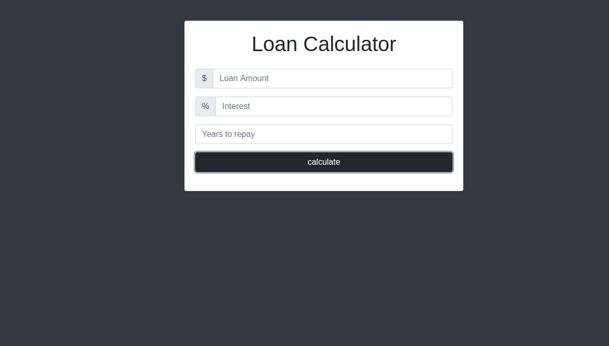
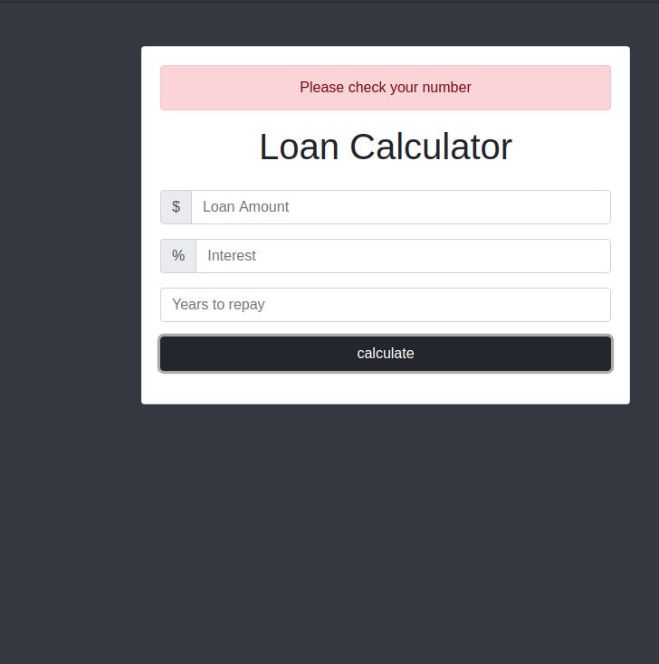
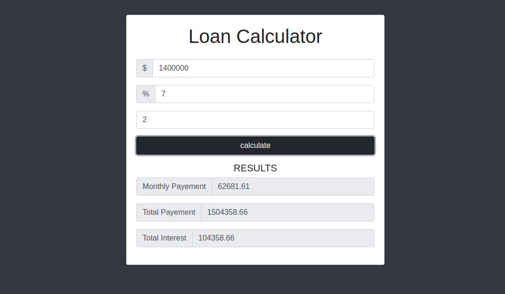

<h1 style="text-align:center">📇 Loan-Calculator </h1>

***

Bad at maths and want to calculate your total  payement and monthly payement of your loans . Here is a web application to help you with 

### 🏁 Tech 
* [Html](https://www.w3.org/TR/html52/)
* [Vanilla JavaScript](https://developer.mozilla.org/en-US/docs/Web/javascript)
* [Bootstrap](https://getbootstrap.com/)

# Sample

